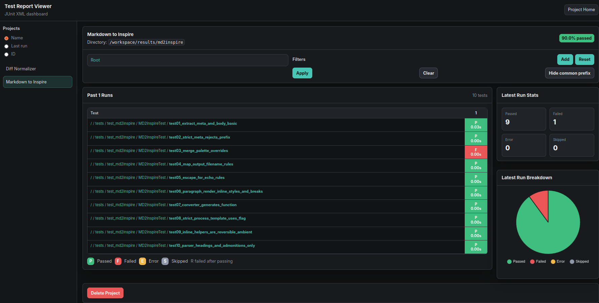

# Test Report Viewer

A test report viewer application that supports both web interface and command-line interface for managing and viewing JUnit XML test reports.



## Quick Start

Install dependencies:
```bash
pip install -r requirements.txt
```

Start the web interface:
```bash
python3 run_web.py --config config.yaml
```

Or use the command-line interface:
```bash
python3 run_cli.py list-projects
```

## Documentation

The documentation, architecture and design decisions could be found at [Design Documentation](docs/DESIGN.md)

## Usage

### Web Interface

Run the web server locally:
```bash
python3 run_web.py --config config.yaml
```

Run in debug mode:
```bash
python3 run_web.py --config config.yaml --debug
```

### Command Line Interface

List all projects:
```bash
python3 run_cli.py list-projects
```

Add a new project:
```bash
python3 run_cli.py add-project "Project Name" "/path/to/test/results"
```

Scan for new test files:
```bash
python3 run_cli.py scan
```

Show project summary:
```bash
python3 run_cli.py project-summary PROJECT_ID
```

### Docker

Build and start with Docker:
```bash
make build
make start
```

Use CLI commands via Docker:
```bash
make start-cli-list
make start-cli-scan
make start-cli-add NAME="Project Name" DIR="/path/to/tests"
```

## Make Targets

### Docker Commands
- `make build` - Build the Docker image
- `make start` - Start web service with Docker
- `make stop` - Stop Docker services
- `make restart` - Restart Docker services
- `make logs` - Follow container logs
- `make ps` - List running containers

### CLI Commands (Docker or Local)
- `make start-cli-list` - List all projects
- `make start-cli-scan` - Scan for new test files
- `make start-cli-add NAME="Project" DIR="/path"` - Add project

### Local Development Commands
- `make cli-list` - List projects (local Python)
- `make cli-scan` - Scan files (local Python)
- `make cli-add NAME="Project" DIR="/path"` - Add project (local Python)
- `make cli-summary ID=1` - Show project summary (local Python)
- `make web-local` - Run web server locally
- `make web-local-dev` - Run web server in debug mode

### Test Commands
- `make test` - Run all tests
- `make test-unit` - Run unit tests only
- `make test-integration` - Run integration tests only
- `make test-models` - Run model tests only
- `make test-parser` - Run parser tests only
- `make test-service` - Run service tests only
- `make test-web` - Run web tests only
- `make test-coverage` - Run tests with coverage report

## Testing

The test suite is organized into focused test modules:

- `tests/test_core_models.py` - Unit tests for data models
- `tests/test_core_parser.py` - Unit tests for JUnit XML parsing
- `tests/test_core_service.py` - Unit tests for business logic service
- `tests/test_web_basic.py` - Basic web interface tests

Run tests with:
```bash
python run_tests.py
```

Or use make targets:
```bash
make test
```

Run specific test categories:
```bash
make test-unit          # Core module tests
make test-integration   # Web interface tests
make test-models        # Model tests only
make test-parser        # Parser tests only
make test-service       # Service tests only
make test-web          # Web tests only
```

## Configuration

Environment variables:
- `PORT` - Web server port (default: 5000)
- `DATABASE_URL` - Database connection string (default: `./data/junit_dashboard.db`)

Configuration files:
- `config.yaml` - Application configuration
- `.env` - Docker environment variables

Data storage:
- `data/` - Database and runtime files (auto-created, git-ignored)
- Database files are stored in `data/` directory to keep project root clean
